## Why model?

- We often only have observational data
  - Models allow us to ask 'what if?, and exploit 'natural experiments'
- Typically inexpensive
- Models make assumptions explicit
  - Many researchers use models implicitly
- Most powerful when they make *testable predictions* or are just plain wrong

---

## Why HIV?

<div>
<!-- IMAGEMAP START-->
<script>
function Switch(picname,location) {
    document.images[picname].src = location;
}
</script>
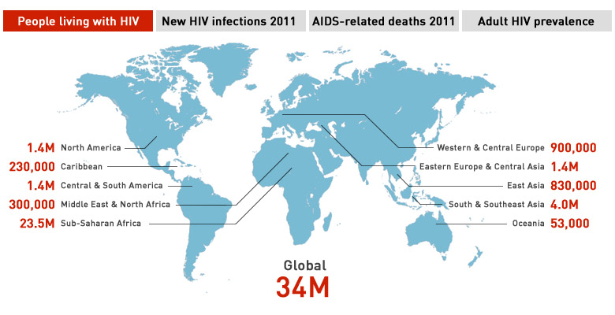
<map name="aids-imagemap">
<area shape="rect" coords="5,13,194,40" href="" onMouseOver="Switch('map','assets/img/aids1.jpg')">
<area shape="rect" coords="198,13,388,40" href="" onMouseOver="Switch('map','assets/img/aids2.jpg')">
<area shape="rect" coords="392,13,582,40" href="" onMouseOver="Switch('map','assets/img/aids3.jpg')">
<area shape="rect" coords="586,13,776,40" href="" onMouseOver="Switch('map','assets/img/aids4.jpg')">
</map>
<!-- IMAGEMAP END-->
</div>

<div style="font-family: Arial; font-size: 12px;" align="right">
<p><em>Graphic: CBC Data:UNAIDS</em></p>
</div>


---

## HIV in the Philippines

```{r,echo=FALSE, eval=TRUE, fig.width=8, fig.height=5, out.extra='style=border:0px;'}
hivtime <- data.frame(Year=seq(2000,2014),
HIV=c(123,174,184,193,199,210,309,342,528,835,1591,2349,3338,4814,6011))
ggplot(hivtime,aes(x=Year,y=HIV,fill=HIV))+geom_bar(stat="identity")+scale_fill_gradient(low="blue",high="red")+geom_text(aes(x=Year,y=HIV,label=HIV),size=4,vjust=-0.5) +theme(legend.justification=c(0,1), legend.position=c(0,1))
```

<div style="font-family: Arial; font-size: 12px;" align="right">
<p><em>Data: Philippines DoH, May 2015</em></p>
</div>

---

## HIV in the UK

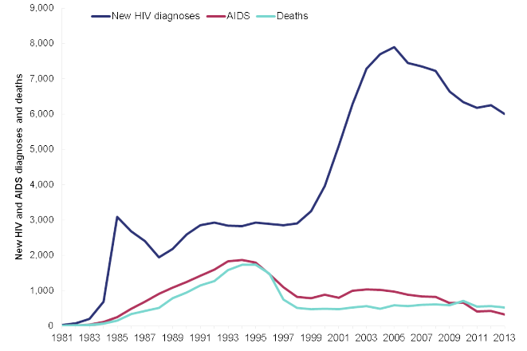

<div style="font-family: Arial; font-size: 12px;" align="right">
<p><em>PHE (2014) HIV in the United Kingdom</em></p>
</div>

---

## HIV drug resistance

- HIV treatment has reduced the number of deaths due to HIV
- However, treatment is associated with **acquired drug resistance**
    - Emerges in response to therapy
- At the population level, we also observed **transmitted drug resistance**
  - Individuals are infected with resistant virus
- We can sequence part of the viral genome to tell whether it is resistant or not

---

## HIV is the most sequenced virus

<div id="viruspie" width="900px" height="600px" >
	<svg width="800" height="500" style="font-family: 'xkcd';font-size: 20px;"></svg>
</div>

---

## HIV as a model evolutionary system

- In addition to there being a vast amount of data, HIV can also tell us about evolutionary processes
- HIV has a short generation time
  - Population dynamics within the individual can occur on a short timescale
- HIV has a high mutation rate
- There is a large number of infected cells within a typical infected person
- HIV is *measurably evolving*

---

## The within-host life cycle of HIV

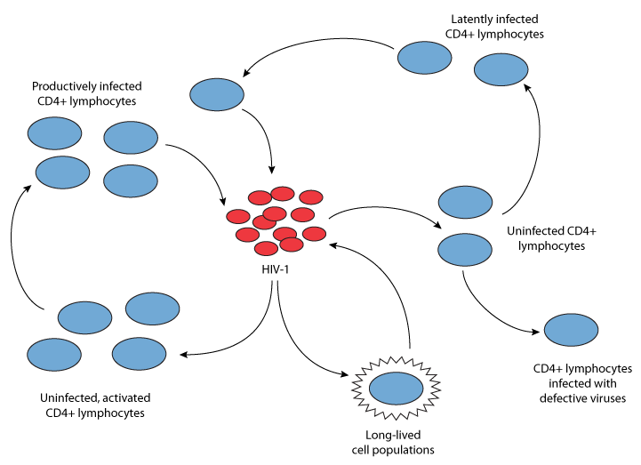

<div style="font-family: Arial; font-size: 12px;" align="right">
<p><em>Perelson (1996)</em></p>
</div>

---

## Multiple scales and HIV

- Within an infected cell
- Within pockets of target cells
- Within an organ
- Between organs
- Between pairs of individuals
- Within a population of individuals
- At the global level

---

## Examples

- Evolution of drug resistance
- Evolution of immune escape
  - Humoral responses
  - Cellular responses
- Molecular epidemiology

---

## Evolution of resistance to AZT

- AZT was the first antiviral agent to be licensed for treatment of HIV
- Although CD4+ counts recovered, the virus rebounded


<br>
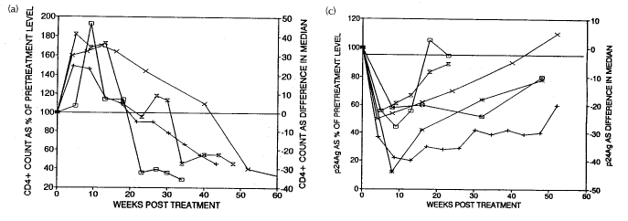

<div style="font-family: Arial; font-size: 12px;" align="right">
<p><em>McLean and Nowak (1992)</em></p>
</div>

---

## Resistance higher with higher doses

<br>


<div style="font-family: Arial; font-size: 12px;" align="right">
<p><em>McLean and Nowak (1992)</em></p>
</div>

---

## Resistance and dose

```{r,echo=FALSE,fig.width=9,fig.height=6,out.extra='style=border:0px;'}
popsizes <- function(z){
  phi <- matrix(c(0.9995*(1-z)*7.2e-8,(1-0.9995)*(1-0.33*z)*2.4e-8,(1-0.9995)*(1-z)*7.2e-8,0.9995*(1-0.33*z)*2.4e-8),nrow=2,ncol=2,byrow=T)
  ev <- eigen(phi)
  l <- max(ev$values)
  v <- abs(ev$vectors[,1])
  x0 <- 35.96/l
  f <- function(x){
    2e8-0.04*x0-x0*((1-z)*7.2e-8*x*v[1]+(1-0.33*z)*2.4e-8*x*v[2])
}
  sol <- uniroot(f,lower=0,upper=x0)
  ys <- sol$root*v[1]
  yr <- sol$root*v[2]
  c(ys,yr)
}
npts <- 101
z <- seq(0,1,length.out=npts)
ys <- rep(0,npts)
yr <- rep(0,npts)
for(i in 1:length(z)){
  y <- popsizes(z[i])
  ys[i] <- y[1]
  yr[i] <- y[2]
}
d <- data.frame(Dose=rep(z,2),Population=c(ys,yr),Type=c(rep("Sensitive",length(ys)),rep("Resistant",length(yr))))
ggplot(d,aes(x=Dose,y=Population,color=Type))+geom_line()+ylab("")
```

<div style="font-family: Arial; font-size: 12px;" align="right">
<p><em>Model from: McLean and Nowak (1992)</em></p>
</div>

---

## Stochastic versus deterministic

- Treatment response varies between individual
- Many biological models are deterministic in nature
  - Model takes the form of differential equations
  - Variability between individuals reflects biological variation
- Variation could arise simply through chance effects

---

## Evolution of 3TC resistance

- 3TC or lamivudine was the second drug to be licensed
- High level resistance can be achieved through mutations at a single site in the reverse transcriptase

<br>
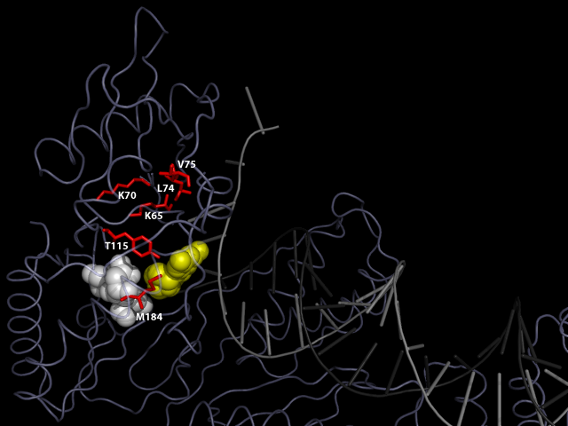

<div style="font-family: Arial; font-size: 12px;" align="right">
<p>http://hivdb.stanford.edu/pages/3DStructures/rt.html</p>
</div>

---

## Evolution of M184I/V

<iframe src="m184v.html" style="border:0px;" width="800px" height="600px"></iframe>

---

## Within-host evolution of M184

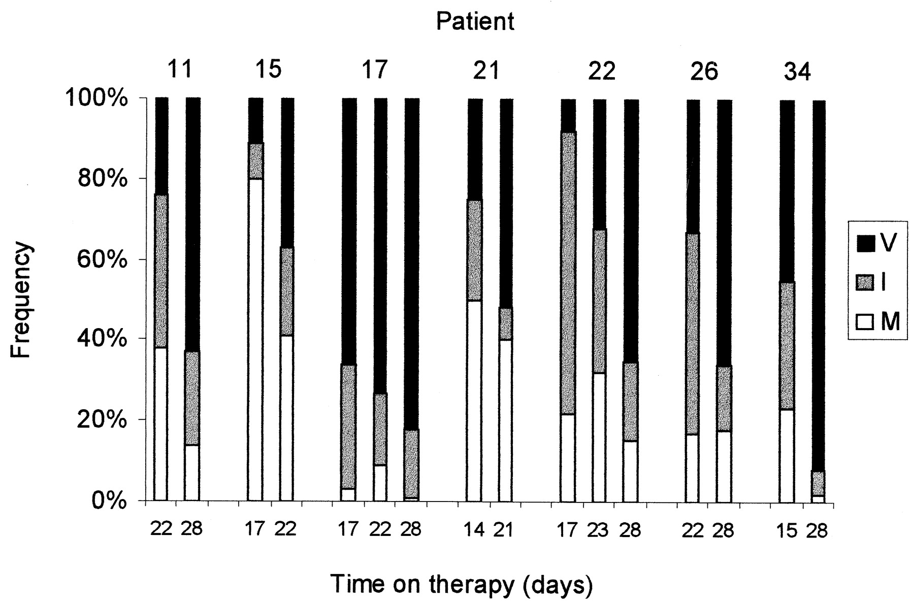

<div style="font-family: Arial; font-size: 12px;" align="right">
<p><em>Frost et al. J. Virol. 2000</em></p>
</div>

---

## Rise of M184V

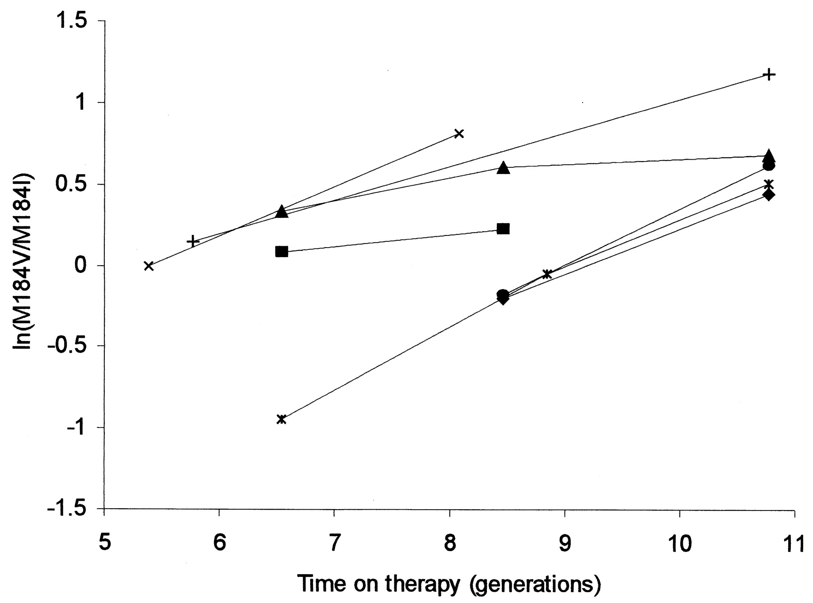

<div style="font-family: Arial; font-size: 12px;" align="right">
<p><em>Frost et al. J. Virol. 2000</em></p>
</div>

---

## Mutation-selection balance

- Prior to therapy, resistant mutations exist at *mutation-selection balance*
- Population genetics theory tells us that there can be random fluctuations due to genetic drift
- The extent of these fluctuations can be captured by the concept of an *effective population size* or $N_e$

---

## Fluctuations in M184V/I before therapy

```{r,echo=FALSE,fig.width=8,fig.height=5,out.extra='style="border:0px"'}
m184mu <- function(Ne,mu1=6e-5,mu2=1.5e-5,s1=0.45,s2=0.28){
  ((mu2*s1)/(mu1*s2))*(1+(1/(Ne*mu1)))
}
m184cv <- function(Ne,mu1=6e-5,mu2=1.5e-5){
  ((Ne*mu1)/(Ne*mu1+1))*sqrt((mu1+mu2)/(Ne*mu1*mu2))
}
lne <- seq(5,8,length.out=100)
ne <- 10^lne
mu <- m184mu(ne)
cv <- m184cv(ne)
d <- data.frame(Ne=rep(ne,2),Value=c(mu,cv),Quantity=c(rep("Mean",length(mu)),rep("CV",length(cv))))
ggplot(d,aes(x=Ne,y=Value,color=Quantity))+geom_line()+ylab("")+scale_x_log10()
```


---

## Why stochastic?

- There are *hundreds of millions* of infected cells in a typical HIV-infected person
- How can stochasticity be important when the population size is so large?

---

## Within host metapopulation dynamics

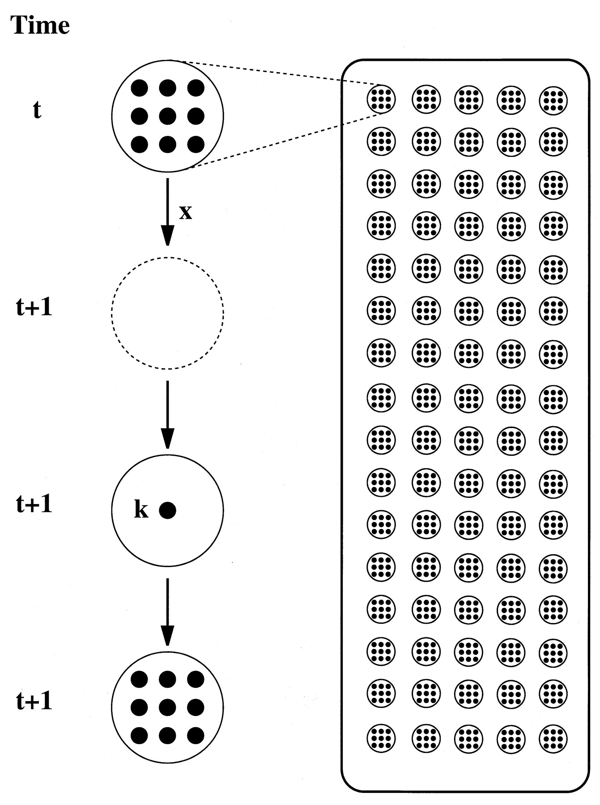

<div style="font-family: Arial; font-size: 12px;" align="right">
<p><em>Frost et al. PNAS 2001</em></p>
</div>

---

## Model

- Implications:
  - Repeated founder effects result in low effective population sizes

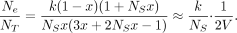

- Predictions:
  - There should be fine-scale spatial structure
  - Within subpopulations, there should be evidence of founder effects

---

## Testing for spatial differentiation

- $F_{ST}$: the fraction of genetic variation *within* subpopulations relative to *total* variation
- Under a metapopulation model:

<br>

$$
F_{ST} = \frac{k+N_s x}{k(1+N_sx)} \approx \frac{1}{k}
$$

---

## Evidence for micro-scale spatial differentiation

<br>

<div>
<table frame="hsides" rules="groups" id="table-1">
                           <thead id="thead-1">
                              <tr id="tr-1">
                                 <th rowspan="1" colspan="1" id="th-1">Patient</th>
                                 <th rowspan="1" colspan="1" id="th-2">Pulps</th>
                                 <th rowspan="1" colspan="1" id="th-3">Between-pulp
                                    variation</th>
                                 <th rowspan="1" colspan="1" id="th-4">Total variation </th>
                                 <th rowspan="1" colspan="1" id="th-5"><em>F</em><sub>ST</sub>
                                                                   </th>
                              </tr>
                           </thead>
                           <tbody align="center" id="tbody-1" class="table-center">
                              <tr id="tr-2">
                                 <td id="td-1">B</td>
                                 <td id="td-2">3</td>
                                 <td id="td-3">1.453</td>
                                 <td id="td-4">2.446</td>
                                 <td id="td-5">0.594
                                    
                                 </td>
                              </tr>
                              <tr id="tr-3">
                                 <td id="td-6">L</td>
                                 <td id="td-7">4</td>
                                 <td id="td-8">0.836</td>
                                 <td id="td-9">2.266</td>
                                 <td id="td-10">0.369
                                    
                                 </td>
                              </tr>
                              <tr id="tr-4">
                                 <td id="td-11">M</td>
                                 <td id="td-12">2</td>
                                 <td id="td-13">−0.041</td>
                                 <td id="td-14">2.380</td>
                                 <td id="td-15">−0.017<sup>ns</sup></td>
                              </tr>
                              <tr id="tr-5">
                                 <td id="td-16">N</td>
                                 <td id="td-17">2</td>
                                 <td id="td-18">0.055</td>
                                 <td id="td-19">0.706</td>
                                 <td id="td-20">0.078
                                    
                                 </td>
                              </tr>
                              <tr id="tr-6">
                                 <td id="td-21">P</td>
                                 <td id="td-22">5</td>
                                 <td id="td-23">0.463</td>
                                 <td id="td-24">2.154</td>
                                 <td id="td-25">0.215
                                    
                                 </td>
                              </tr>
                              <tr id="tr-7">
                                 <td id="td-26">S</td>
                                 <td id="td-27">4</td>
                                 <td id="td-28">0.146</td>
                                 <td id="td-29">1.629</td>
                                 <td id="td-30">0.090</td>
                              </tr>
                           </tbody>
                        </table>
</div>

---

## Testing for founder effects

- Under neutrality, for a constant population size at equilibrium:

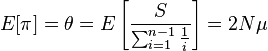

- Tajima's D compares the estimates of $\theta$ obtained from pairwise distances and from segregating sites:
  - $D<0$: e.g. population bottleneck
  - $D=0$: e.g. constant population size
  - $D>0$: e.g. population contraction

---

## Evidence for local founder effects

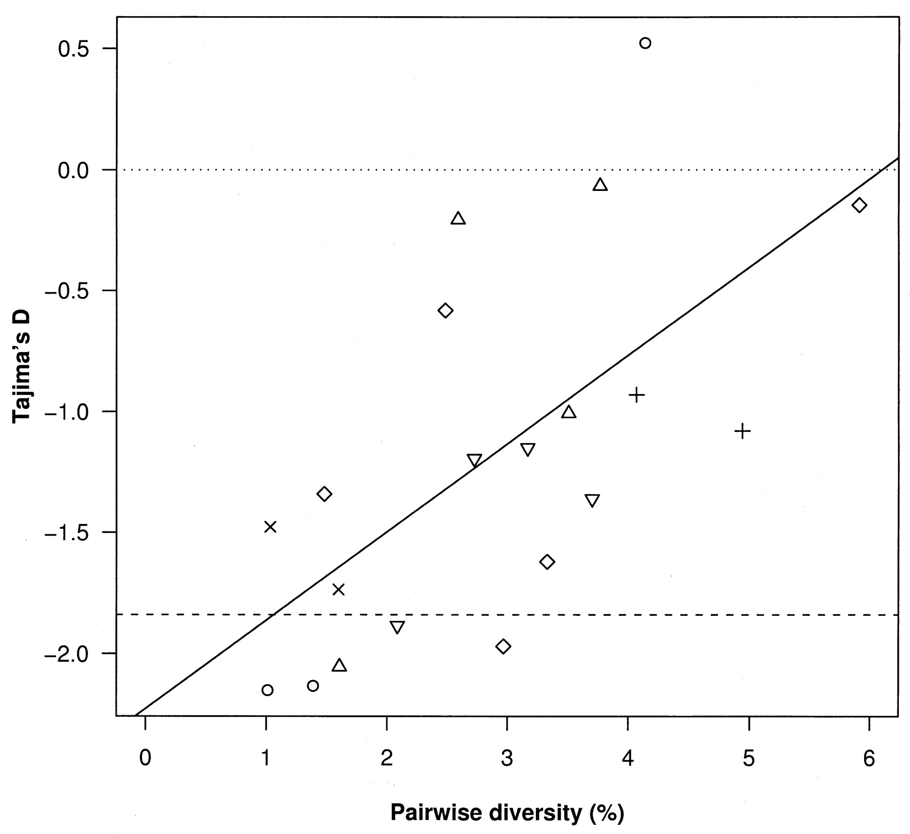

<div style="font-family: Arial; font-size: 12px;" align="right">
<p><em>Frost et al. (2001) PNAS</em></p>
</div>

---

## Transmission and reversion of drug resistance

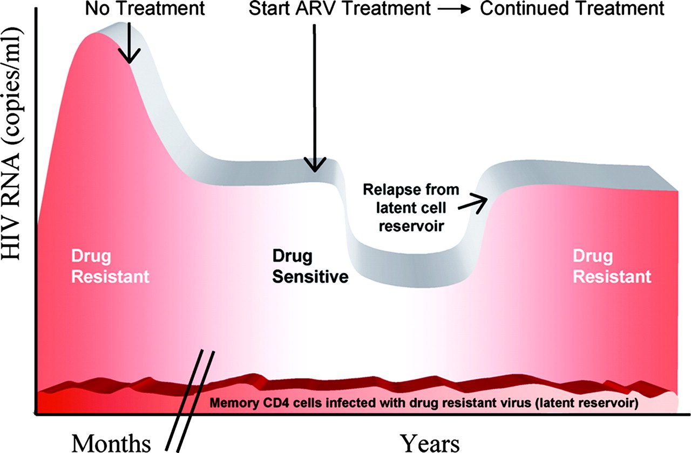

<div style="font-family: Arial; font-size: 12px;" align="right">
<p><em>Little, Frost et al. J. Virol. (2008)</em></p>
</div>

---

## Reversion of transmitted resistance

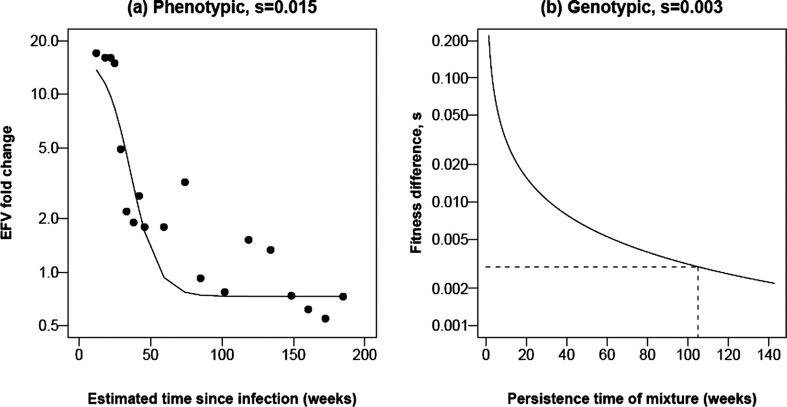

<div style="font-family: Arial; font-size: 12px;" align="right">
<p><em>Little, Frost et al. J. Virol. (2008)</em></p>
</div>

---

## Resistant mutants are 'fit'


<div style="font-family: Arial; font-size: 12px;" align="right">
<p><em>Little, Frost et al. J. Virol. (2008)</em></p>
</div>

---

## Summary

- Acquired resistance can emerge rapidly
  - Pre-existing, but variable, resistant virus
  - Decreasing wild-type viruses results in more target cells, facilitating the emergence of resistance
- Transmitted fitness may revert slowly
- Given rapid escape and slow reversion, we would expect transmitted resistance to be very common
  - Transmitted resistance is rarer than expected, possibly due to lower transmission rates

---

## Escape from immune responses

- In addition to selection by antiviral agents, there is also selection from the adaptive immune response
  - Humoral (antibody) responses
  - Cellular (cytotoxic T lymphocyte, CTL) responses
- What are the dynamics of escape *within* infected individuals?
- How is this affected by transmission *between* individuals?

---

## Dynamics of antibody responses

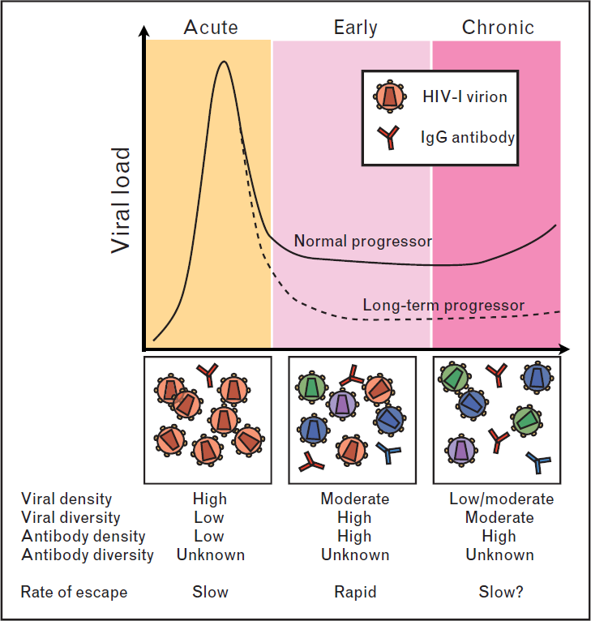

<div style="font-family: Arial; font-size: 12px;" align="right">
<p><em>Frost et al. Curr. Opin. HIV AIDS (2008)</em></p>
</div>

---

## Measuring antibody responses

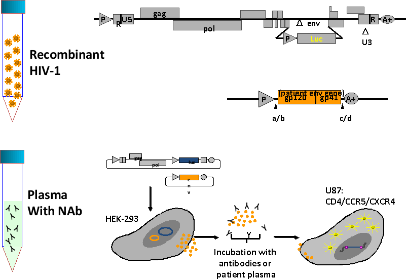

---

## Within-host antibody responses

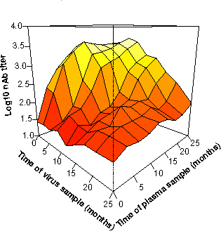

<div style="font-family: Arial; font-size: 12px;" align="right">
<p><em>Frost et al. PNAS (2005)</em></p>
</div>

---

## Variation between individuals

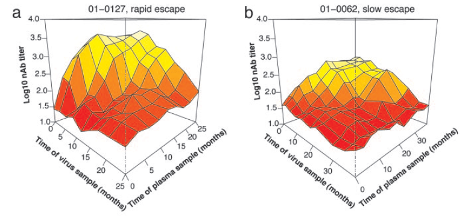

<div style="font-family: Arial; font-size: 12px;" align="right">
<p><em>Frost et al. PNAS (2005)</em></p>
</div>

---

## Modelling escape from antibody responses

- It was long perceived that antibodies are ineffective in controlling HIV
- Some individuals *do* mount powerful responses
  - Too little, too late

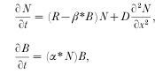

<div style="font-family: Arial; font-size: 12px;" align="right">
<p><em>Haraguchi and Sasaki (1997)</em></p>
</div>

---

## Model results

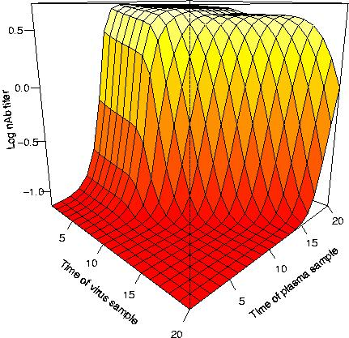

<div style="font-family: Arial; font-size: 12px;" align="right">
<p><em>Frost et al. PNAS (2005)</em></p>
</div>

---

## Cross-reactivity and escape

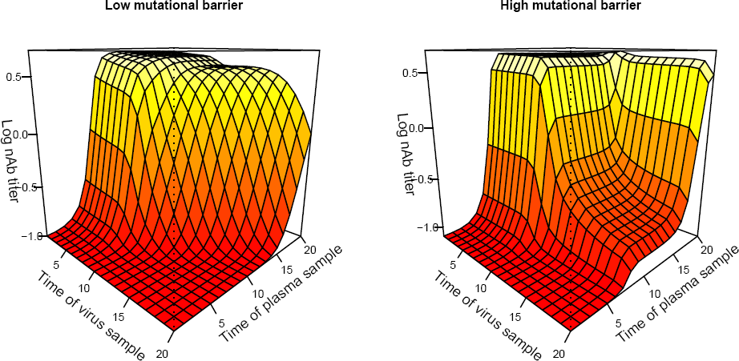

<div style="font-family: Arial; font-size: 12px;" align="right">
<p><em>Frost et al. PNAS (2005)</em></p>
</div>

---

## Cellular responses

- Another important arm of the adaptive immune response is the cytotoxic T lymphocyte (CTL) response
- CTLs recognise infected cells, as these cells present viral peptides at their surface
- HIV can escape specific CTL responses through a small number of mutations
- On transmission with an escape mutant:
  - Mutant will revert back to wild type (if mutant is not recognised)
  - Mutant will remain (if mutant is recognised)
- These lead to complex dynamics, depending on the transmission rate

---

## CTL responses and escape


<div style="font-family: Arial; font-size: 12px;" align="right">
<p><em>Poon et al. PLoS Path 2007</em></p>
</div>

---

## Model predictions

- Evolution at the population level reflects the 'averaging' over multiple individuals
- Variation within the individual is affected by the transmission rate

---

## Capturing selection pressure

- A common bioinformatic approach to detecting selection is to compare $dN$ and $dS$:
  - $dN$: the rate of *nonsynonymous* or amino acid changing mutations
  - $dS$: the rate of *synonymous* or amino acid preserving mutations
- The relative rates of $dN$ and $dS$ are informative about different types of selection

---

## Capturing within- and between-host variation

- Between-host variation:
  - $dN$ and $dS$ counted along the viral phylogeny
- Within-host variation
  - Compare nonsynonymous and synonymous *mixtures*

---

## What are mixtures?

- When we sequence a sample of blood from an infected person, we actually sequence a *swarm* of different variants
- Variation in this swarm can be detected by mixtures

<br>

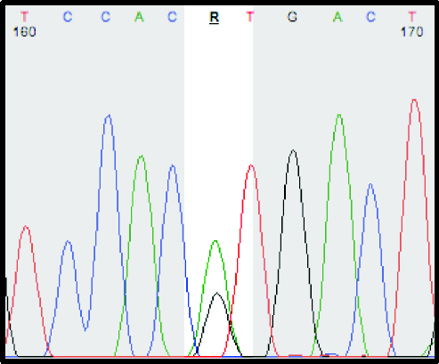

---

## Why are mixtures important?

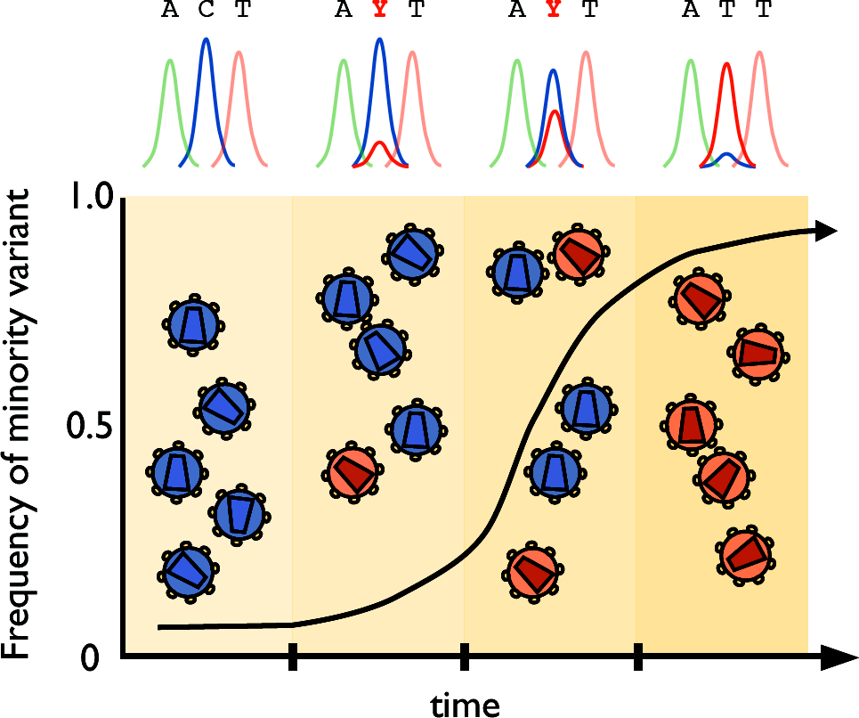

---

## Selection pressures within and between hosts


<div style="font-family: Arial; font-size: 12px;" align="right">
<p><em>Poon et al. PLoS Path 2007</em></p>
</div>

---

## Selection on CTL epitopes

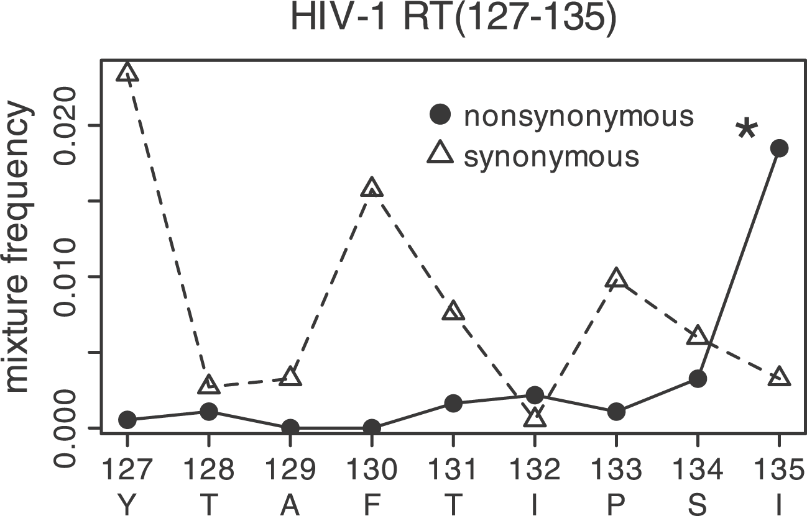

<div style="font-family: Arial; font-size: 12px;" align="right">
<p><em>Poon et al. PLoS Path 2007</em></p>
</div>

---

## Conclusions

- Our ability to understand what goes on *within* the HIV infected individual is attributable to increased data
  - Availability of therapy
  - Sequence data
  - Phenotypic data
  - Modeling has moved from being 'data-free' to one which is data-intensive
- HIV evolution and dynamics occurs at the 'front line' within the individual, and variation at the population level reflects averaging over the selection pressures from many hosts

--- ds:blackout

<h2 style="color:#FFFFFF">Acknowledgements</h2>

<div style="color:#FFFFFF">

- Too many to list, but especially
  - Angela McLean
  - Sergei Kosakovsky Pond
  - Art Poon
  - Doug Richman
  
</div>

<br>

<h3 style="color:#FFFFFF">Funding</h2>


```{r,echo=FALSE,eval=FALSE}
publish(user = "sdwfrost", repo = "ugpn")
```

