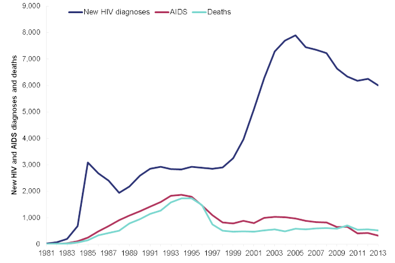
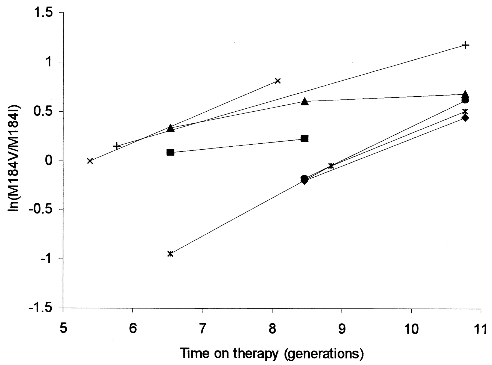
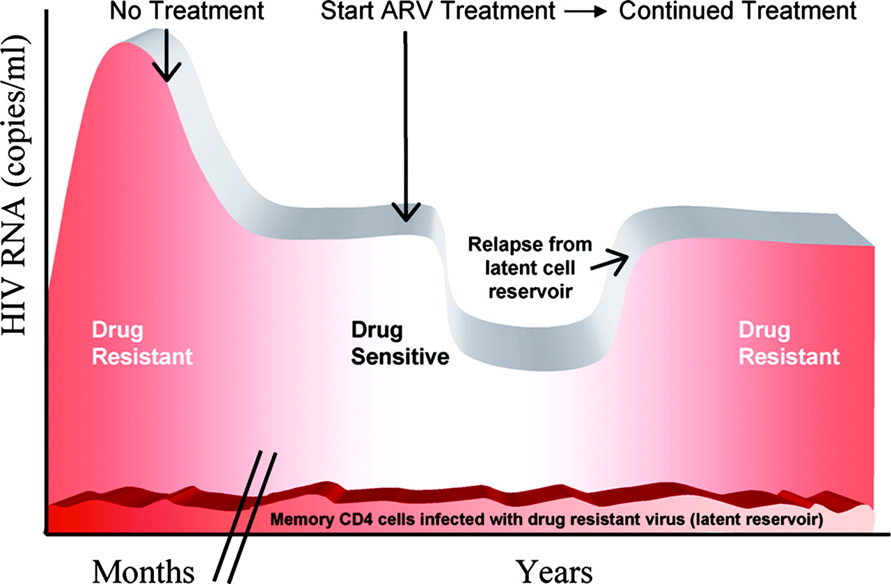
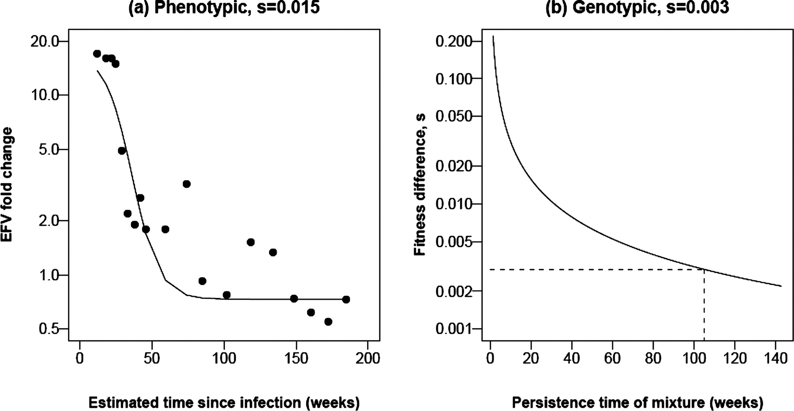
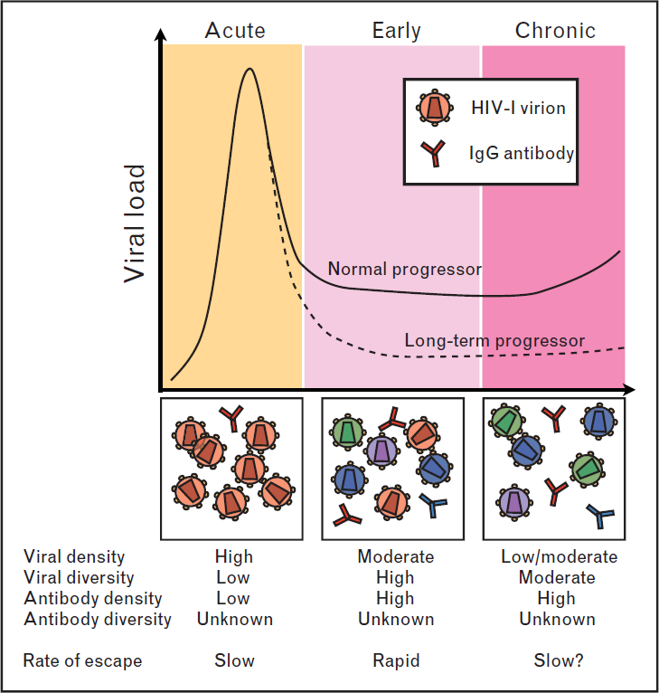

## Introduction

- Dynamics linked to evolution
- Link between within and between host scales

---

## Why model?

- Observational data
- Natural experiments
- Cheap
- Makes assumptions clear

---

## People living with HIV

<!-- IMAGEMAP START-->

<map name="aids-imagemap">
<area shape="rect" coords="5,13,194,40" href="" onMouseOver="Switch('map','assets/img/aids1.jpg')">
<area shape="rect" coords="198,13,388,40" href="" onMouseOver="Switch('map','assets/img/aids2.jpg')">
<area shape="rect" coords="392,13,582,40" href="" onMouseOver="Switch('map','assets/img/aids3.jpg')">
<area shape="rect" coords="586,13,776,40" href="" onMouseOver="Switch('map','assets/img/aids4.jpg')">
</map>
<!-- IMAGEMAP END-->

<em>Graphic: CBC Data:UNAIDS</em>

---

## HIV in the UK

---

## HIV drug resistance

- HIV treatment has reduced the number of deaths due to HIV
- However, treatment is associated with **acquired drug resistance**
    - Emerges in response to therapy
- At the population level, we also observed **transmitted drug resistance**
  - Individuals are infected with resistant virus

---

## The within-host life cycle of HIV

<em>Perelson (1996)</em>

---

## Target cells and evolution of resistance

Frost and McLean 1994

---

## Stochastic versus deterministic

- Treatment response varies between individual
- Many biological models are deterministic in nature
  - Model takes the form of differential equations
  - Variability between individuals reflects biological variation
- Variation could arise simply through chance effects

---

## Within-host evolution of M184

<em>Frost et al. J. Virol. 2000</em>

---

## Rise of M184V

<em>Frost et al. J. Virol. 2000</em>

---

## Mutation-selection balance

- Genetic drift

---

## Why stochastic?

---

## Within host metapopulation dynamics

<em>Frost et al. PNAS 2001</em>

---

## Model

- Implications:
  - Repeated founder effects result in low effective population sizes

- Predictions:
  - There should be fine-scale spatial structure
  - Within subpopulations, there should be evidence of founder effects

---

## Evidence for micro-scale spatial differentiation

<table frame="hsides" rules="groups" id="table-1">
                           <thead id="thead-1">
                              <tr id="tr-1">
                                 <th rowspan="1" colspan="1" id="th-1">Patient</th>
                                 <th rowspan="1" colspan="1" id="th-2">Number of pulps analyzed</th>
                                 <th rowspan="1" colspan="1" id="th-3">Between-pulp
                                    variation <em>V</em>a</th>
                                 <th rowspan="1" colspan="1" id="th-4">Total variation
                                    <em>V</em>b</th>
                                 <th rowspan="1" colspan="1" id="th-5"><em>F</em>ST
                                    (⩵<em>V</em>a/<em>V</em>b)
                                    
                                 </th>
                              </tr>
                           </thead>
                           <tbody align="center" id="tbody-1" class="table-center">
                              <tr id="tr-2">
                                 <td id="td-1">B</td>
                                 <td id="td-2">3</td>
                                 <td id="td-3">1.453</td>
                                 <td id="td-4">2.446</td>
                                 <td id="td-5">0.594
                                    
                                 </td>
                              </tr>
                              <tr id="tr-3">
                                 <td id="td-6">L</td>
                                 <td id="td-7">4</td>
                                 <td id="td-8">0.836</td>
                                 <td id="td-9">2.266</td>
                                 <td id="td-10">0.369
                                    
                                 </td>
                              </tr>
                              <tr id="tr-4">
                                 <td id="td-11">M</td>
                                 <td id="td-12">2</td>
                                 <td id="td-13">−0.041</td>
                                 <td id="td-14">2.380</td>
                                 <td id="td-15">−0.017ns</td>
                              </tr>
                              <tr id="tr-5">
                                 <td id="td-16">N</td>
                                 <td id="td-17">2</td>
                                 <td id="td-18">0.055</td>
                                 <td id="td-19">0.706</td>
                                 <td id="td-20">0.078
                                    
                                 </td>
                              </tr>
                              <tr id="tr-6">
                                 <td id="td-21">P</td>
                                 <td id="td-22">5</td>
                                 <td id="td-23">0.463</td>
                                 <td id="td-24">2.154</td>
                                 <td id="td-25">0.215
                                    
                                 </td>
                              </tr>
                              <tr id="tr-7">
                                 <td id="td-26">S</td>
                                 <td id="td-27">4</td>
                                 <td id="td-28">0.146</td>
                                 <td id="td-29">1.629</td>
                                 <td id="td-30">0.090</td>
                              </tr>
                           </tbody>
                        </table>

---

## Evidence for local founder effects

---

## Transmission and reversion of drug resistance

<em>Little, Frost et al. J. Virol. (2008)</em>

---

## Reversion of transmitted resistance

<em>Little, Frost et al. J. Virol. (2008)</em>

---

## Resistant mutants are 'fit'

<em>Little, Frost et al. J. Virol. (2008)</em>

---

## Transmission fitness

---

## Summary

- Acquired resistance can emerge rapidly
  - Pre-existing, but variable, resistant virus
  - Decreasing wild-type viruses results in more target cells, facilitating the emergence of resistance
- Transmitted fitness may revert rapidly
- Given rapid escape and slow reversion, we would expect transmitted resistance to be very common
  - Transmitted resistance is rarer than expected, possibly due to lower transmission rates

---

## Escape from immune responses

- In addition to selection by antiviral agents, there is also selection from the adaptive immune response
  - Humoral (antibody) responses
  - Cellular (cytotoxic T lymphocyte, CTL) responses
- What are the dynamics of escape *within* infected individuals?
- How is this affected by transmission *between* individuals?

---

## Dynamics of antibody responses

<em>Little, Frost et al. Curr. Opin. HIV AIDS (2008)</em>

---

## Measuring antibody responses

---

## Within-host antibody responses

<em>Little, Frost et al. PNAS (2005)</em>

---

## Variation between individuals

<em>Little, Frost et al. PNAS (2005)</em>

---

## Modeling neutralisation escape

<em>Little, Frost et al. PNAS (2005)</em>

---

## Cross-reactivity and escape

<em>Little, Frost et al. PNAS (2005)</em>

---

## Population level patterns

- If HIV escapes from the immune system rapidly, how is it recognised at all, decades after its spread?
  - Escape is highly specific

---

## Cellular responses

- Another important arm of the adaptive immune response is the cytotoxic T lymphocyte (CTL) response
- CTLs recognise infected cells, as these cells present viral peptides at their surface
- HIV can escape specific CTL responses through a small number of mutations
- On transmission with an escape mutant:
  - Mutant will revert back to wild type (if mutant is not recognised)
  - Mutant will remain (if mutant is recognised)
- These lead to complex dynamics, depending on the transmission rate

---

## CTL responses and escape

<em>Poon et al. PLoS Path 2007</em>

---

## Model predictions

- Evolution at the population level reflects the 'averaging' over multiple individuals
- Variation within the individual is affected by the transmission rate

---

## Conclusions

- Our ability to understand what goes on *within* the HIV infected individual is attributable to increased data
  - Availability of therapy
  - Sequence data
  - Phenotypic data
  - Modeling has moved from being 'data-free' to one which is data-intensive
- HIV evolution and dynamics occurs at the 'front line' within the individual, and variation at the population level reflects averaging over the selection pressures from many hosts

--- ds:cobalt

## Acknowledgements

